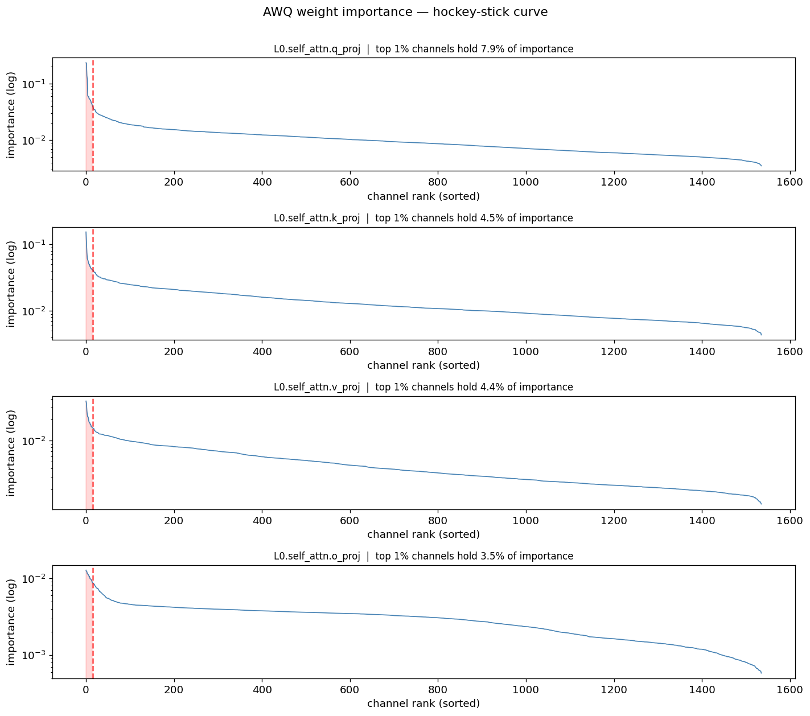
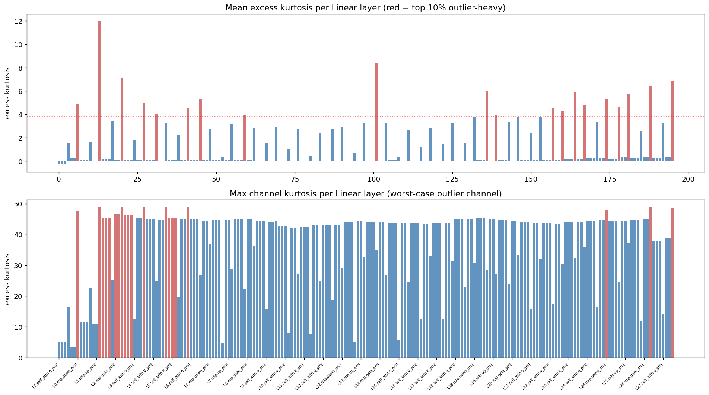
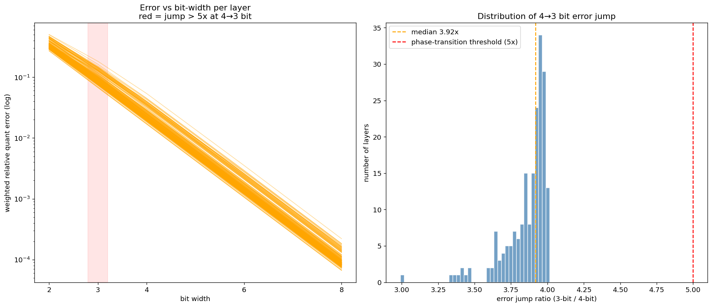
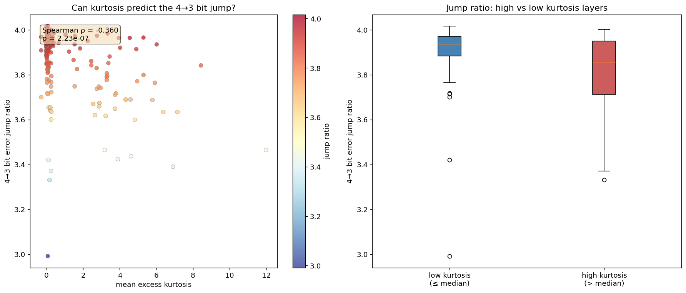
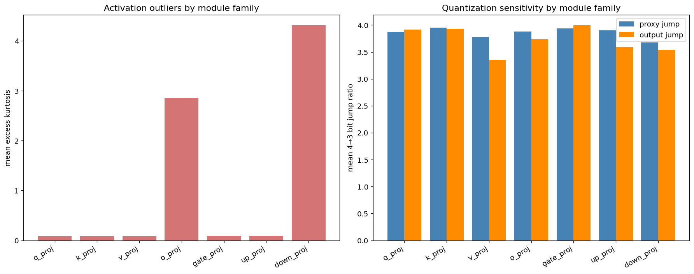
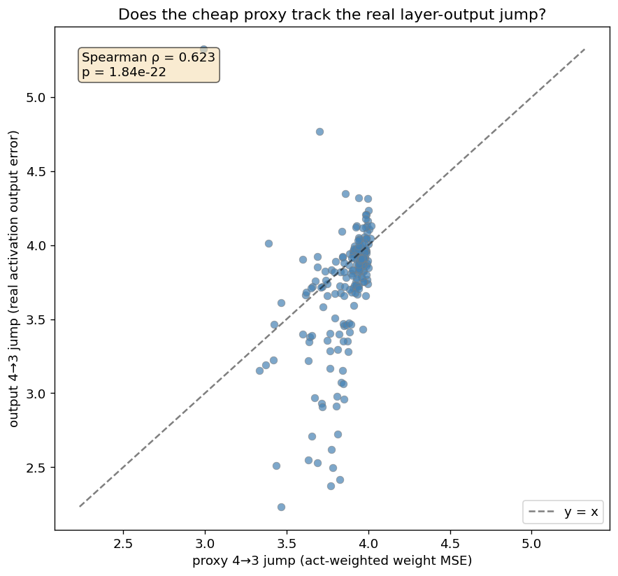
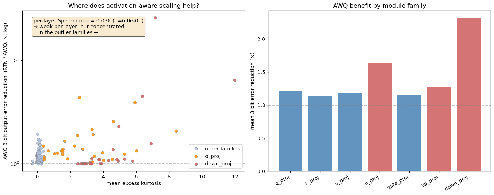
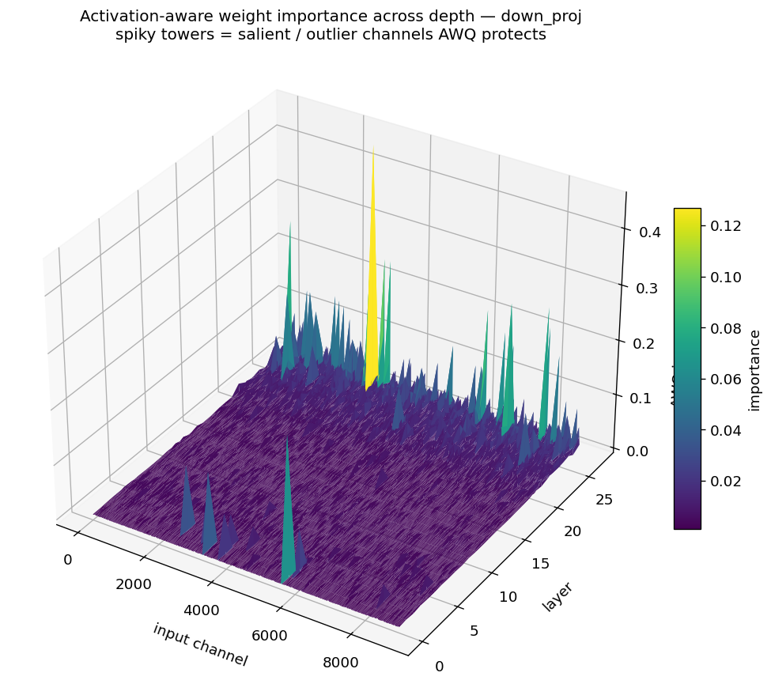
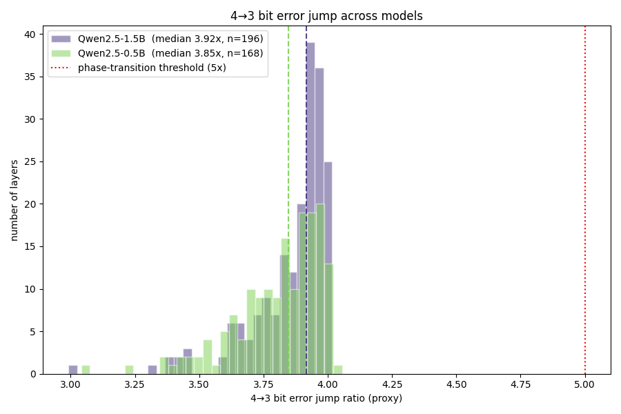

# AWQ-Diag

**A diagnostic toolkit for understanding *why* low-bit LLM quantization fails — not another quantizer.**

[](https://www.python.org/)
[](https://pytorch.org/)
[](LICENSE)

> 📖 **New here?** Start with the **[0→100 walkthrough (`docs/understanding.md`)](docs/understanding.md)** —
> it builds up every concept (quantization, outliers, AWQ, kurtosis) from scratch and explains
> every figure and result.

AWQ-Diag instruments a Hugging Face causal LM with PyTorch forward hooks, reproduces the
[AWQ](https://arxiv.org/abs/2306.00978) activation-aware saliency picture, and runs a per-layer
bit-width sweep (8 → 2 bit) to ask a focused question:

> **Is there a bit-width where the quantization error *suddenly* blows up (a "phase transition"), and can a cheap single-layer statistic (kurtosis) predict where?**

The honest answer is **no — and that negative result is the point.** There is no special
"collapse bit": the error grows by a near-constant **~4× per bit at every step** (8→6→4→3→2), so
the catastrophic 2-bit error (~27% of the layer output) is the *cumulative* result of a smooth
analytic law, not a sudden transition. Activation outliers are real and concentrated in specific
module families, but they only raise the *absolute* error floor — they never predict a per-step
jump. This replicates across two model sizes.

> ⚠️ This is a **learning-oriented diagnostic project**, not a claim of a new quantization method.
> It is designed to demonstrate understanding of AWQ, activation outliers, and low-bit failure —
> and to honestly report a hypothesis that did not hold. See [`docs/research_gap_plan.md`](docs/research_gap_plan.md)
> for the full honest positioning.

---

## Key findings

Measured on `Qwen/Qwen2.5-1.5B` and replicated on `Qwen/Qwen2.5-0.5B`:

| Question | Metric | Result | Verdict |
|---|---|---|---|
| Does AWQ saliency concentrate? | top-1% channel importance share | up to **17.6%** (≈18× the uniform 1%) | ✅ hockey-stick reproduced |
| Do activation outliers exist? | max excess kurtosis | **κ ≈ 12** (`layers.1.mlp.down_proj`) | ✅ yes, very heavy-tailed |
| Are outliers module-specific? | mean kurtosis by family | **`down_proj` & `o_proj` ≫ everything else** | ✅ strong structure |
| Is there a phase transition at **any** bit? | per-bit error ratio (8→6→4→3→2) | **4.0 / 4.0 / 3.6 / 3.4×** per bit | ❌ no — smooth ~4×/bit, even *decelerates* |
| Where does the model actually collapse? | median output error by bit | 4b **2.2%** → 3b **7.9%** → 2b **27%** | ⚠️ 2-bit (but it's cumulative, not a jump) |
| Does kurtosis predict the 4→3 **jump**? | Spearman ρ(κ, jump) | **−0.36** proxy / **−0.11** output (1.5B); −0.26 (0.5B) | ❌ negative — it does not |
| Does kurtosis predict the 3→2 **jump**? | Spearman ρ(κ, output jump) | **−0.25** (vs 4→3's −0.11 output); only >5× layers are *low*-κ | ❌ even more negative |
| Does kurtosis predict the **error level**? | Spearman ρ(κ, error), 3-bit / 2-bit | **+0.52 / +0.53** | ✅ yes — at every bit (different thing!) |
| Does the cheap proxy track real output error? | Spearman ρ(proxy jump, output jump) | **+0.62** (1.5B), **+0.66** (0.5B) | ⚠️ partially |
| Does AWQ-style scaling help the outlier layers? | 3-bit output-error reduction by family | `down_proj`/`o_proj` **~2.0–2.3×** vs others **~1.2×** (max **25.9×**) | ✅ AWQ rescues exactly the outlier families |

**The one-line takeaway:** *under round-to-nearest, low-bit error follows a smooth ~4×/bit law, so
the 2-bit collapse is cumulative rather than a sudden transition; kurtosis explains the **level** of
that error at every bit (ρ≈+0.5), but never the per-step **jump** (ρ≈−0.1 at 4→3, −0.25 at 3→2).*
Low-bit failure is therefore unlikely to be a pure single-layer-statistics phenomenon — which
points the next investigation toward **inter-layer error propagation**.

> **Why not make 2-bit the headline?** 2-bit is where the *absolute* error is largest (~27%), and
> it is reported in full. But (a) the per-step jump there is the *smallest* (3.4×, not a transition),
> and (b) usable 2-bit needs quantization-aware training, not round-to-nearest — so RTN-2-bit is the
> "worst baseline", not evidence about real 2-bit. The diagnostic centers on the 4→3 *onset* (4-bit
> usable → 3-bit painful) while reporting the whole 8→2 curve.

We also *implement* AWQ's activation-aware scaling (not just describe it): a per-input-channel
scaling search that protects salient channels before quantizing. It cuts the 3-bit output error
of `down_proj`/`o_proj` by ~2× on average (up to **25.9×** for one layer) while barely helping the
low-outlier families — a clean, **positive** confirmation of AWQ's core thesis at the module-family
level, even though per-layer kurtosis is too noisy to rank within the dominant low-outlier families.

---

## Figures

| AWQ saliency (hockey-stick) | Kurtosis by layer |
|---|---|
|  |  |

| Bit-width sweep & 4→3 jump | Kurtosis vs jump (the negative result) |
|---|---|
|  |  |

| Module-family breakdown | Proxy vs real output error |
|---|---|
|  |  |

**AWQ vs RTN** — implementing AWQ's activation-aware scaling and measuring where it helps. The
outlier families (`o_proj`, `down_proj`) are rescued the most; the low-outlier families barely move:



**Activation-aware importance across depth** — the classic outlier-channel surface
(`x` = input channel, `y` = layer, `z` = AWQ importance `|W|·|x|`). The spiky towers are
the salient/outlier channels AWQ protects; here for `down_proj`, the highest-kurtosis family:



**Cross-model replication** (the negative result is not a 1.5B fluke):



The **module-family** figure is the clearest summary: `o_proj` and `down_proj` have *dramatically*
higher activation kurtosis than every other projection, yet the 4→3 bit jump ratio is essentially
**flat across all families**. Outliers ≠ quantization sensitivity.

---

## What it measures

For every `nn.Linear` inside the Transformer blocks, a forward hook collects **per-input-channel**:

| Statistic | Meaning |
|---|---|
| `channel_magnitude` | mean \|x\| — the AWQ saliency signal |
| `channel_variance` | spread of the activation distribution |
| `channel_max` | worst-case activation |
| `kurtosis` | excess kurtosis (0 = Gaussian; ≫0 = heavy-tailed / outliers) |
| `outlier_ratio` | fraction of \|x\| > 6σ |

Then, per layer, two complementary error notions across `{8,6,4,3,2}`-bit symmetric
per-output-channel weight quantization:

- **proxy error** — activation-weighted weight MSE (cheap; weights + activation magnitude only).
- **output error** — the *real* relative layer-output error `‖Wx − Ŵx‖ / ‖Wx‖` measured on the
  actual calibration activations (the "ground truth" the proxy is checked against).

A second pass then runs an **AWQ scaling search**: for each layer/bit it grid-searches the
per-input-channel scaling exponent `s = (mean|x|)^α` that minimizes output error (α=0 is exactly
plain RTN), and reports how much that activation-aware protection beats RTN per layer.

See [`docs/report.md`](docs/report.md) for the full method, math, and interpretation.

---

## Quickstart

The environment is managed with **micromamba** (or conda/mamba).

```bash
# 1. Create the environment (PyTorch cu128 — adjust for your CUDA / CPU)
micromamba env create -f environment.yml
micromamba activate awq-diag

# 2. Run the diagnostic on one model (writes results/ + figures/)
python scripts/run_diagnostic.py --model Qwen/Qwen2.5-1.5B
python scripts/run_diagnostic.py --model Qwen/Qwen2.5-0.5B

# 3. Build the cross-model comparison
python scripts/compare_models.py results/diagnostic_*.json

# 4. (optional) run the unit tests
pytest
```

CPU-only / non-CUDA machines:

```bash
python scripts/run_diagnostic.py --model Qwen/Qwen2.5-0.5B --device cpu --dtype float32
```

Outputs land in:

```
results/diagnostic_<model>.json      # full per-layer record + summary (see schema below)
figures/<model>/*.png                # 8 per-model figures (incl. 3D importance surfaces)
figures/cross_model_jump_distribution.png
results/cross_model_summary.md
```

---

## Repository layout

```
AWQ-Diag/
├── src/awq_diag/          # the package
│   ├── config.py          # DiagConfig — one object controls a run
│   ├── data.py            # calibration texts
│   ├── model_utils.py     # model loading + layer bookkeeping
│   ├── hooks.py           # ActivationCollector (the core: stats + output-error tracing)
│   ├── quant.py           # symmetric per-channel quant + error metrics
│   ├── analysis.py        # per-layer records, summary, module-family, correlations
│   ├── plotting.py        # the 8 figures (incl. 3D AWQ importance surface)
│   ├── pipeline.py        # end-to-end orchestration
│   └── cli.py             # `awq-diag` console entry
├── scripts/
│   ├── run_diagnostic.py  # run one model
│   └── compare_models.py  # cross-model summary
├── results/               # JSON outputs + cross-model table
├── figures/               # generated PNGs
├── notebooks/
│   └── awq_diagnostic.ipynb   # the original exploratory notebook (bilingual, educational)
├── docs/
│   ├── report.md          # full write-up (method → findings → limitations → next steps)
│   ├── note.md            # author's original project note (中文)
│   └── research_gap_plan.md   # honest positioning & research-gate analysis
├── tests/                 # pytest (quant core, CPU-only, no model download)
├── environment.yml        # micromamba/conda environment
├── requirements.txt       # pip fallback
└── pyproject.toml
```

The `.py` pipeline is the canonical, reproducible entry point and **exactly reproduces** the
original notebook's headline numbers (median 3.92× jump, ρ = −0.360, top-κ layer
`layers.1.mlp.down_proj` at κ ≈ 12).

---

## Output JSON schema (v2)

```jsonc
{
  "model": "Qwen/Qwen2.5-1.5B",
  "config":      { "bit_widths": [8,6,4,3,2], "outlier_sigma": 6.0, "seed": 0, ... },
  "model_info":  { "num_params": ..., "num_layers": 28, "num_linear_analyzed": 196, ... },
  "summary": {
    "proxy_jump_4to3":  { "min": .., "median": .., "mean": .., "max": .., "num_above_5x": 0 },
    "output_jump_4to3": { ... },
    "awq_reduction_3bit": { "min": 1.0, "median": .., "max": 25.85, ... },
    "correlations": {
      "kurtosis_vs_proxy_jump_spearman":        [-0.360, 2.2e-07],
      "kurtosis_vs_3bit_proxy_error_spearman":  [ 0.553, 4.1e-17],
      "proxy_jump_vs_output_jump_spearman":     [ 0.623, 1.8e-22],
      "kurtosis_vs_awq_reduction_spearman":     [ 0.038, 6.0e-01]
    },
    "module_family": { "down_proj": { "mean_kurtosis": .., "mean_awq_reduction_3bit": 2.31, ... }, ... }
  },
  "layers": {
    "model.layers.0.self_attn.q_proj": {
      "module_type": "q_proj", "layer_idx": 0,
      "mean_kurtosis": .., "top1pct_importance_share": ..,
      "proxy_error":  { "8": .., "4": .., "3": .., "2": .. },
      "output_error": { ... }, "awq_output_error": { ... },
      "proxy_jump_4to3": .., "output_jump_4to3": .., "awq_reduction_3bit": .., "awq_best_alpha": {..}
    }
  },
  "jump_ratios": { ... },   // backward-compatible flat views from the original notebook
  "kurtosis":    { ... }
}
```

---

## Limitations & honest scope

- **One architecture family** (Qwen2.5, two sizes). Conclusions are not claimed to generalize to
  Llama/Gemma/Phi.
- **Proxy / output error are layer-local.** They are *not* end-task quality (perplexity / accuracy).
  The proxy↔output comparison is a first step toward closing that gap, but it stops at layer output.
- **Small calibration set** (4 paragraphs) — enough to characterize per-channel distributions, not
  to make distributional claims about rare events.
- **Simplified quantizer.** The base is symmetric per-output-channel RTN (chosen deliberately as a
  fixed, assumption-free probe so cross-layer differences reflect the *layer*, not an optimizer).
  The AWQ pass adds activation-aware scaling on top, but it is *not* the full deployed AWQ
  (group-wise + asymmetric zero-point + folded scales) and there is no GPTQ baseline — so absolute
  error magnitudes are not comparable to production AWQ/GPTQ numbers.

## Next steps

The negative result sharpens the next hypothesis: low-bit failure is likely an **inter-layer
error-propagation** phenomenon rather than a single-layer one. Concretely:

1. **Single-layer quantization injection** — quantize one layer, measure final-logit KL / perplexity,
   and trace how local error grows (or is absorbed by the residual stream) downstream.
2. **Connect proxy error to model-level metrics** (logit KL, perplexity).
3. **Broader model families** to test whether `down_proj`/`o_proj` outlier concentration is universal.

A staged validation-gate plan for turning this into research is in
[`docs/research_gap_plan.md`](docs/research_gap_plan.md).

## References

- AWQ — [Activation-aware Weight Quantization](https://arxiv.org/abs/2306.00978) (MLSys 2024 Best Paper)
- GPTQ — [Accurate Post-Training Quantization](https://arxiv.org/abs/2210.17323)
- SmoothQuant — [arxiv 2211.10438](https://arxiv.org/abs/2211.10438)
- OmniQuant — [arxiv 2308.13137](https://arxiv.org/abs/2308.13137)

## License

MIT — see [LICENSE](LICENSE).
