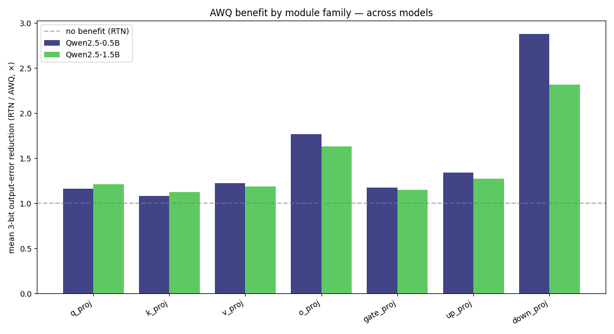

# AWQ-Diag

**Understand and *visualize* AWQ — an empirical look at whether "activation-aware importance" is real and actually matters.**

[](https://www.python.org/)
[](https://pytorch.org/)
[](LICENSE)

> 📖 **New here?** Start with the **[0→100 walkthrough (`docs/understanding.md`)](docs/understanding.md)** —
> it builds up every concept (quantization, activations, AWQ, importance) from scratch and explains
> every figure.

[AWQ](https://arxiv.org/abs/2306.00978) (Activation-aware Weight Quantization, MLSys 2024 Best Paper)
rests on one idea: **not all weights are equal — a weight matters in proportion to the activation it
multiplies, so the few "salient" channels should be protected.** AWQ-Diag instruments Qwen2.5 with
PyTorch forward hooks to make that idea **concrete, visual, and testable**:

> **What does AWQ's "activation importance" actually look like inside a real LLM — and does protecting the important channels really reduce quantization error?**

The answer is **yes, clearly** — and the project shows it four ways:

1. **Importance is highly concentrated** — the classic AWQ hockey-stick: a handful of channels hold a
   disproportionate share of the total importance.
2. **The important channels are genuine activation outliers**, concentrated in specific modules
   (`o_proj`, `down_proj`) — not spread uniformly.
3. **You can see it** — a 3D map of importance across every channel and layer (the spiky
   "outlier-channel" surface from the AWQ / SmoothQuant / LLM.int8() papers).
4. **It is operationally meaningful** — we *implement* AWQ's scaling (protect the salient channels
   before quantizing) and measure the payoff: it cuts low-bit error **most exactly where importance
   concentrates** (`down_proj` ~2.3×, up to **25.9×** on a single layer), and barely touches the
   low-importance modules. Protecting the "important" channels demonstrably helps — so the importance
   notion has real meaning, not just intuition.

> This is a **learning project to understand AWQ deeply** — reproduce its saliency picture, visualize
> it, and verify its central premise empirically. It is not a new quantization method.

---

## Key findings

Measured on `Qwen/Qwen2.5-1.5B`, replicated on `Qwen/Qwen2.5-0.5B`:

| What we ask of AWQ's idea | Metric | Result |
|---|---|---|
| Is importance concentrated? | top-1% channel importance share | up to **17.6%** in one layer (≈18× the uniform 1%) — hockey-stick ✅ |
| Are the salient channels real outliers? | max excess kurtosis | **κ ≈ 12** (`layers.1.mlp.down_proj`); heavy-tailed ✅ |
| Where do they live? | mean kurtosis / importance by module | concentrated in **`down_proj` & `o_proj`** (≈35–55× the other projections) ✅ |
| **Does protecting them actually help?** | 3-bit output-error reduction, AWQ vs RTN | **`down_proj` 2.31× · `o_proj` 1.63×** vs others ~1.2× (max **25.9×**) ✅ |
| Does that hold across sizes? | same, on Qwen2.5-0.5B | `down_proj`/`o_proj` ~2.3× vs others ~1.2× (max **28.9×**) ✅ |

**The one-line takeaway:** *AWQ's "activation importance" is not just a heuristic — importance is
sharply concentrated in a few real outlier channels (`o_proj`/`down_proj`), and protecting exactly
those channels with AWQ scaling measurably reduces quantization error. The protection helps most
precisely where the importance says it should.*

---

## Figures

**1 · AWQ importance is concentrated (the hockey-stick).** Sorted per-channel importance
`|W|·|x|` (log y): a few channels dominate, which is the entire premise of AWQ.


**2 · Visualizing AWQ importance across the network.** `x` = input channel, `y` = layer,
`z` = importance `|W|·|x|`. The spiky towers are the salient/outlier channels AWQ protects (here for
`down_proj`, the highest-outlier family). This is the picture that motivates activation-aware
quantization, drawn from a real model.


**3 · Where the importance lives.** Activation outliers — and therefore importance — are
concentrated in `o_proj` and `down_proj`, far above the other projections.


**4 · Importance is *meaningful*: protecting the salient channels works.** Implementing AWQ's
per-channel scaling and measuring the 3-bit output-error reduction vs plain round-to-nearest. The
benefit lands **exactly** on the high-importance families (`o_proj`, `down_proj`); the low-importance
families barely move. This is the empirical payoff of the importance notion.


**Cross-model replication.** The AWQ benefit by module family on both sizes — the protection lands on
`o_proj`/`down_proj` in each:



<details>
<summary>Supporting diagnostics</summary>

Per layer, kurtosis confirms the salient channels are genuine heavy-tailed outliers (an
`importance_surface_o_proj` view is also generated per model):


</details>

---

## What it measures

For every `nn.Linear` inside the Transformer blocks, a forward hook collects **per-input-channel**:

| Statistic | Meaning |
|---|---|
| `channel_magnitude` | mean \|x\| — the **AWQ saliency signal** |
| `kurtosis` | excess kurtosis — confirms the salient channels are genuine heavy-tailed outliers |
| `outlier_ratio` | fraction of \|x\| > 6σ |
| `channel_variance`, `channel_max` | distribution spread / worst case |

From these it builds the **AWQ importance** `|W|·|x|` per channel (and the top-1% share), the per-layer
weight-quantization error across `{8,6,4,3,2}` bits (both an activation-weighted *proxy* and the real
*output* error `‖Wx − Ŵx‖/‖Wx‖`), and — the key step — runs an **AWQ scaling search**: for each
layer/bit it grid-searches the per-input-channel scaling `s = (mean|x|)^α` that minimizes output error
(`α=0` is exactly plain RTN), reporting how much protecting the salient channels beats RTN.

See [`docs/report.md`](docs/report.md) for the full method and math.

---

## Quickstart

The environment is managed with **micromamba** (or conda/mamba).

```bash
# 1. Create the environment (PyTorch cu128 — adjust for your CUDA / CPU)
micromamba env create -f environment.yml
micromamba activate awq-diag

# 2. Run the diagnostic on one model (writes results/ + figures/)
python scripts/run_diagnostic.py --model Qwen/Qwen2.5-1.5B
python scripts/run_diagnostic.py --model Qwen/Qwen2.5-0.5B

# 3. Build the cross-model comparison
python scripts/compare_models.py results/diagnostic_*.json

# 4. (optional) run the unit tests
pytest
```

CPU-only / non-CUDA machines:

```bash
python scripts/run_diagnostic.py --model Qwen/Qwen2.5-0.5B --device cpu --dtype float32
```

Outputs land in:

```
results/diagnostic_<model>.json      # full per-layer record + summary (see schema below)
figures/<model>/*.png                # 9 per-model figures (incl. 3D importance surfaces + AWQ benefit)
results/cross_model_summary.md
```

---

## Repository layout

```
AWQ-Diag/
├── src/awq_diag/          # the package
│   ├── config.py          # DiagConfig — one object controls a run
│   ├── data.py            # calibration texts
│   ├── model_utils.py     # model loading + layer bookkeeping
│   ├── hooks.py           # ActivationCollector + AWQErrorCollector (the AWQ scaling search)
│   ├── quant.py           # symmetric per-channel quant, AWQ scaling, error metrics
│   ├── analysis.py        # per-layer records, summary, module-family, importance
│   ├── plotting.py        # the 9 figures (incl. 3D AWQ importance surface, AWQ benefit)
│   ├── pipeline.py        # end-to-end orchestration
│   └── cli.py             # `awq-diag` console entry
├── scripts/
│   ├── run_diagnostic.py  # run one model
│   └── compare_models.py  # cross-model summary
├── results/               # JSON outputs + cross-model table
├── figures/               # generated PNGs
├── notebooks/
│   └── awq_diagnostic.ipynb   # the original exploratory notebook (bilingual, educational)
├── docs/
│   ├── report.md          # full write-up
│   ├── note.md            # author's original project note (中文)
│   └── research_gap_plan.md   # honest positioning
├── tests/                 # pytest (quant core, CPU-only, no model download)
├── environment.yml        # micromamba/conda environment
├── requirements.txt       # pip fallback
└── pyproject.toml
```

The `.py` pipeline is the canonical, reproducible entry point; it reproduces the original
exploratory notebook's importance/saliency numbers (e.g. top-κ layer `layers.1.mlp.down_proj`, κ ≈ 12).

---

## Output JSON schema

```jsonc
{
  "model": "Qwen/Qwen2.5-1.5B",
  "config":      { "bit_widths": [8,6,4,3,2], "outlier_sigma": 6.0, "seed": 0, ... },
  "model_info":  { "num_params": ..., "num_layers": 28, "num_linear_analyzed": 196, ... },
  "summary": {
    "awq_reduction_3bit": { "min": 1.0, "median": .., "max": 25.85, ... },  // AWQ vs RTN benefit
    "module_family": { "down_proj": { "mean_kurtosis": 4.31, "mean_awq_reduction_3bit": 2.31, ... }, ... },
    "per_bit_median_output_error": { "8": .., "4": 0.022, "3": 0.079, "2": 0.268 },
    "correlations": { ... }            // includes the supporting kurtosis / proxy diagnostics
  },
  "layers": {
    "model.layers.0.self_attn.q_proj": {
      "module_type": "q_proj", "layer_idx": 0,
      "mean_kurtosis": .., "top1pct_importance_share": ..,
      "output_error": { "8": .., "3": .., "2": .. }, "awq_output_error": { ... },
      "awq_reduction_3bit": .., "awq_best_alpha": { ... }
    }
  }
}
```

---

## Limitations & honest scope

- **Simplified quantizer.** The base is symmetric per-output-channel round-to-nearest; the AWQ pass
  adds the activation-aware per-channel scaling search on top. It captures AWQ's *mechanism* but is
  not the full deployed AWQ (group-wise + asymmetric zero-point + folded scales), and there is no
  GPTQ baseline — so absolute error magnitudes are illustrative, not production numbers.
- **Layer-local error**, not end-task quality (perplexity / accuracy) — the AWQ benefit is measured at
  the layer output, not yet propagated to model-level metrics.
- **One architecture family** (Qwen2.5, two sizes) and a small calibration set (4 paragraphs).

## Next steps

1. **Group-wise + asymmetric AWQ** to move from "mechanism demo" toward the real quantizer.
2. **Connect the layer-level AWQ benefit to model-level quality** (perplexity / logit KL) — does
   protecting the important channels recover end-task accuracy, not just layer-output error?
3. **More model families** (Llama / Gemma / Phi) to test whether the `o_proj`/`down_proj` importance
   concentration is universal.

## References

- AWQ — [Activation-aware Weight Quantization](https://arxiv.org/abs/2306.00978) (MLSys 2024 Best Paper)
- GPTQ — [Accurate Post-Training Quantization](https://arxiv.org/abs/2210.17323)
- SmoothQuant — [arxiv 2211.10438](https://arxiv.org/abs/2211.10438)
- LLM.int8() — [arxiv 2208.07339](https://arxiv.org/abs/2208.07339)

## License

MIT — see [LICENSE](LICENSE).
